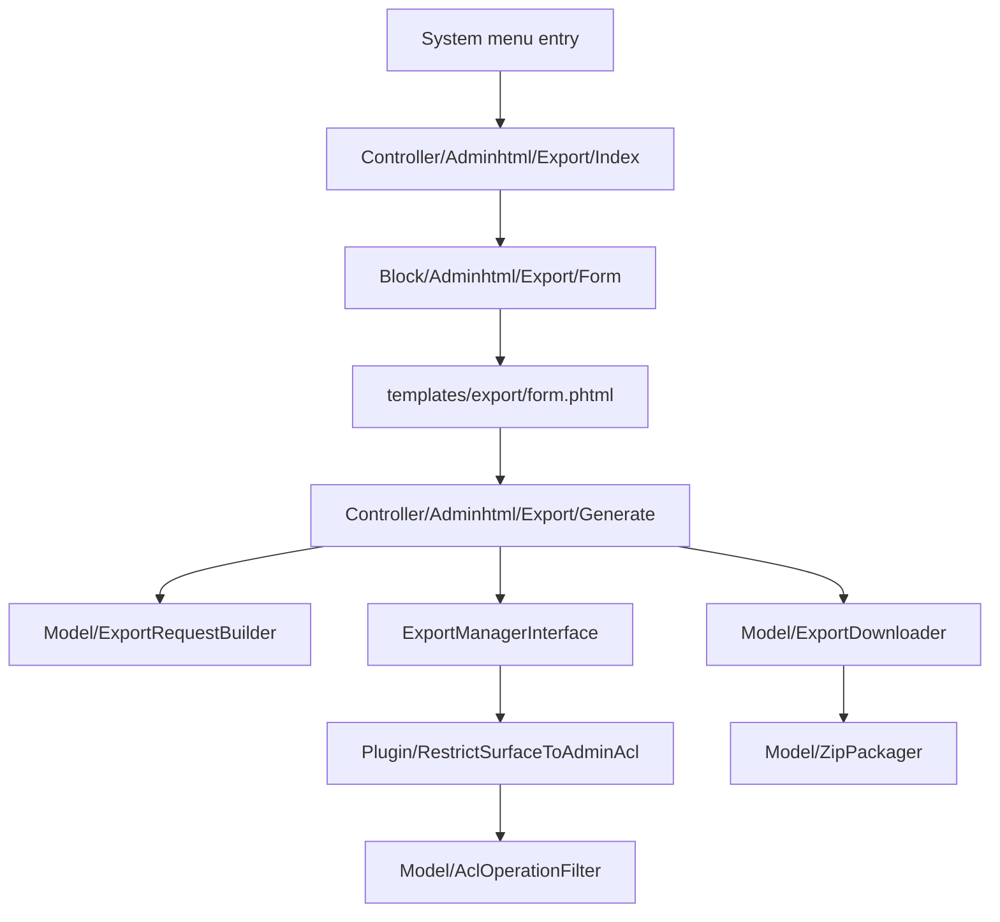

# Muon_ApiSchemaExportAdminUi — Technical Reference

Generated 2026-08-24.

## Request flow

## Controllers

| Route | Class | Method | ACL |
|---|---|---|---|
| `muon_apischemaexport/export/index` | `Controller/Adminhtml/Export/Index.php` | GET | `Muon_ApiSchemaExport::export` |
| `muon_apischemaexport/export/generate` | `Controller/Adminhtml/Export/Generate.php` | POST | `Muon_ApiSchemaExport::export` |

`Generate` implements `HttpPostActionInterface` and does **not** implement
`CsrfAwareActionInterface`, so Magento's admin form-key validation applies unmodified.

Front name `muon_apischemaexport`, declared in `etc/adminhtml/routes.xml`.

## Menu

`etc/adminhtml/menu.xml` adds `Muon_ApiSchemaExportAdminUi::export` under
`Magento_Backend::system`, resource `Muon_ApiSchemaExport::export`.

## Plugin

| Plugin | Intercepts | Declared in |
|---|---|---|
| `muon_api_schema_export_admin_acl_filter` | `Muon\ApiSchemaExport\Api\SurfaceResolverInterface::resolve` (after) | `etc/adminhtml/di.xml` |

Registered in the **adminhtml** area only, which is what keeps the console command unfiltered.
Interception is the only place this can happen: the export manager resolves and renders in one
call, so a controller never sees the surface in between.

## Why a template form and not a ui_component

There is no entity here for a `DataProvider` to bind to — the screen is a stateless action, not an
edit page. The form is `Block/Adminhtml/Export/Form.php` plus
`view/adminhtml/templates/export/form.phtml`, wired by
`view/adminhtml/layout/muon_apischemaexport_export_index.xml`. Every dynamic value in the template
goes through `Magento\Framework\Escaper`.

## Download handling

`Model/ExportDownloader.php` streams one file directly and packs several into a ZIP through
`Model/ZipPackager.php`. Both paths hand `FileFactory` the **array** content form carrying
`rm => true`: `FileFactory` writes whatever it is given into the base directory and only deletes it
afterwards when that flag is present, so a bare string would leave one file behind in `var/` for
every download, permanently.

Archive names are resolved by `ZipPackager::resolveArchiveName()`, which routes through the core
module's `FilenameSanitizer` — no caller can bypass it.

## Layout note

`Controller/Adminhtml/Export/Index.php` injects `Magento\Framework\View\Result\PageFactory`, not
`Magento\Backend\Model\View\Result\PageFactory`. Only the framework factory calls
`$page->addDefaultHandle()`; the auto-generated Backend factory is a plain `create()`, so the
`default` layout handle is never added, the `menu` block that handle declares never exists, and
`setActiveMenu()` fatals on `false`. The adminhtml preference still makes the result a Backend page,
hence the `@var` cast at the call site.

## No schema changes

Stateless. The only filesystem write is a transient ZIP under `var/tmp`, removed once the response
has been sent.

## Test coverage

29 unit tests, 94 assertions, 82.5% line coverage — 99% excluding the two controllers, which are
covered behaviourally by the Phase 6B smoke suite rather than by mock-heavy unit tests.
